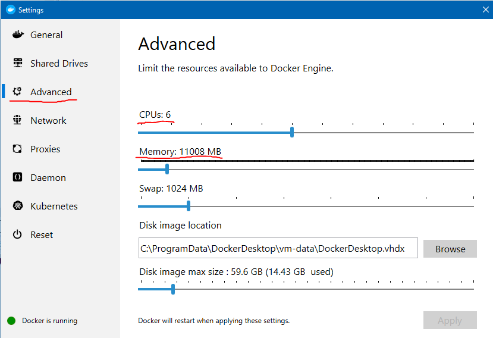

## Building and running application locally
To build and run application locally using JVM mode type:

`mvnw compile quarkus:dev`

Application compiles and starts. It listens on 8080 port. You should see output similar to this:

```
E:\ceh\quarkus\stock-quote>mvnw compile quarkus:dev
[INFO] Scanning for projects...
[INFO]
[INFO] --------------------< com.stocktrader:stock-quote >---------------------
[INFO] Building stock-quote 1.0.0-SNAPSHOT
[INFO] --------------------------------[ jar ]---------------------------------
[INFO]
[INFO] --- maven-resources-plugin:2.6:resources (default-resources) @ stock-quote ---
[INFO] Using 'UTF-8' encoding to copy filtered resources.
[INFO] Copying 4 resources
[INFO]
[INFO] --- maven-compiler-plugin:3.8.1:compile (default-compile) @ stock-quote ---
[INFO] Nothing to compile - all classes are up to date
[INFO]
[INFO] --- quarkus-maven-plugin:1.3.2.Final:dev (default-cli) @ stock-quote ---
Listening for transport dt_socket at address: 5005
__  ____  __  _____   ___  __ ____  ______
 --/ __ \/ / / / _ | / _ \/ //_/ / / / __/
 -/ /_/ / /_/ / __ |/ , _/ ,< / /_/ /\ \
--\___\_\____/_/ |_/_/|_/_/|_|\____/___/
2020-04-30 14:18:22,933 DEBUG [io.qua.ely.sec.pro.dep.ElytronPropertiesProcessor] (build-42) Configuring from PropertiesRealmConfig, users=users.properties, roles=roles.properties
2020-04-30 14:18:24,885 INFO  [io.qua.arc.pro.BeanProcessor] (build-26) Found unrecommended usage of private members (use package-private instead) in application beans:
        - @Inject field com.ibm.hybrid.cloud.sample.stocktrader.stockquote.StockQuote#apiConnectClient,
        - @Inject field com.ibm.hybrid.cloud.sample.stocktrader.stockquote.StockQuote#iexClient
2020-04-30 14:18:25,258 INFO  [com.ibm.hyb.clo.sam.sto.sto.StockQuote] (main) API Connect URL not found from env var from config map, so defaulting to value in jvm.options: null
2020-04-30 14:18:25,258 INFO  [com.ibm.hyb.clo.sam.sto.sto.StockQuote] (main) IEX URL not found from env var from config map, so defaulting to value in jvm.options: null
2020-04-30 14:18:25,258 WARNING [com.ibm.hyb.clo.sam.sto.sto.StockQuote] (main) No API key provided for IEX.  If API Connect isn't available, fallback to direct calls to IEX will fail
2020-04-30 14:18:25,259 INFO  [com.ibm.hyb.clo.sam.sto.sto.StockQuote] (main) Initializing Redis pool using URL: redis://localhost:6379
2020-04-30 14:18:25,272 INFO  [com.ibm.hyb.clo.sam.sto.sto.StockQuote] (main) Initialization complete!
2020-04-30 14:18:25,643 DEBUG [io.qua.ely.sec.run.ElytronPropertiesFileRecorder] (main) createRealm, config=PropertiesRealmConfig{, realmName='MyRealm', enabled=true, users='users.properties', roles='roles.properties', plainText=true}
2020-04-30 14:18:25,645 DEBUG [io.qua.ely.sec.run.ElytronPropertiesFileRecorder] (main) loadRealm, config=PropertiesRealmConfig{, realmName='MyRealm', enabled=true, users='users.properties', roles='roles.properties', plainText=true}
2020-04-30 14:18:25,645 DEBUG [io.qua.ely.sec.run.ElytronPropertiesFileRecorder] (main) Trying to loader users: /users.properties
2020-04-30 14:18:25,646 DEBUG [io.qua.ely.sec.run.ElytronPropertiesFileRecorder] (main) users: file:/E:/ceh/quarkus/stock-quote/target/classes/users.properties
2020-04-30 14:18:25,646 DEBUG [io.qua.ely.sec.run.ElytronPropertiesFileRecorder] (main) Trying to loader roles: roles.properties
2020-04-30 14:18:25,646 DEBUG [io.qua.ely.sec.run.ElytronPropertiesFileRecorder] (main) roles: file:/E:/ceh/quarkus/stock-quote/target/classes/roles.properties
2020-04-30 14:18:25,693 DEBUG [io.qua.ely.sec.run.ElytronRecorder] (main) buildDomain, realm=org.wildfly.security.auth.realm.LegacyPropertiesSecurityRealm@6219da85
The application is starting...
2020-04-30 14:18:26,198 INFO  [com.ibm.hyb.clo.sam.sto.sto.StockQuote] (main) Initializing Redis pool using URL: redis://localhost:6379
2020-04-30 14:18:26,202 INFO  [com.ibm.hyb.clo.sam.sto.sto.StockQuote] (main) Initialization complete!
2020-04-30 14:18:26,204 INFO  [io.quarkus] (main) stock-quote 1.0.0-SNAPSHOT (powered by Quarkus 1.3.2.Final) started in 4.421s. Listening on: http://0.0.0.0:8080
2020-04-30 14:18:26,204 INFO  [io.quarkus] (main) Profile dev activated. Live Coding activated.
2020-04-30 14:18:26,205 INFO  [io.quarkus] (main) Installed features: [cdi, jaeger, kubernetes, mutiny, rest-client, resteasy, resteasy-jsonb, security, security-properties-file, smallrye-context-propagation, smallrye-fault-tolerance, smallrye-health, smallrye-jwt, smallrye-metrics, smallrye-openapi, smallrye-opentracing, swagger-ui, vertx, vertx-web]

```
 
## Running application locally in native mode
To run in native mode you need working C development environment. For details how to set it up please refer to https://quarkus.io/guides/building-native-image
Once you have that all set up you can build your application using following command:

`mvnw package -Pnative`

## Building in docker
Sometimes you cannot install C development environment or your development platform is different that your target runtime platform (e.g. Win vs Linux).
You can utilize docker to build and compile your application.

This is using multistage docker build. Native compilation requires lots of resources, especially memory, so make sure that docker engine has enough resources.

If you are doing build form Docker Desktop for Windows, first go to settings and change the following:
- Memory to at least 10GB (required)
- CPU - to at least 4 (more if you can)

 

Being in the stock-quote directory issue

`docker build -f src/main/docker/Dockerfile.multistage -t quarkus-stock-quote-native .`

After a successful build (it takes a while), start the image:

`docker run -i --rm -p 8080:8080 quarkus-stock-quote-native`

Access with the browser http://localhost:8080/stock-quote/IBM

